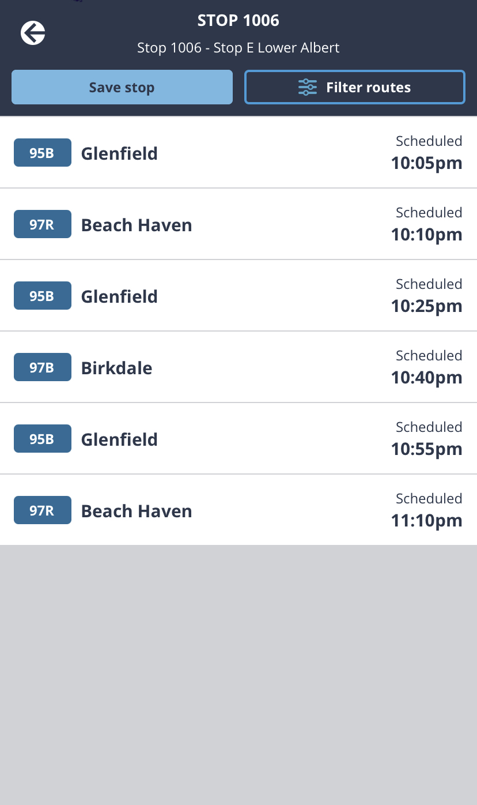
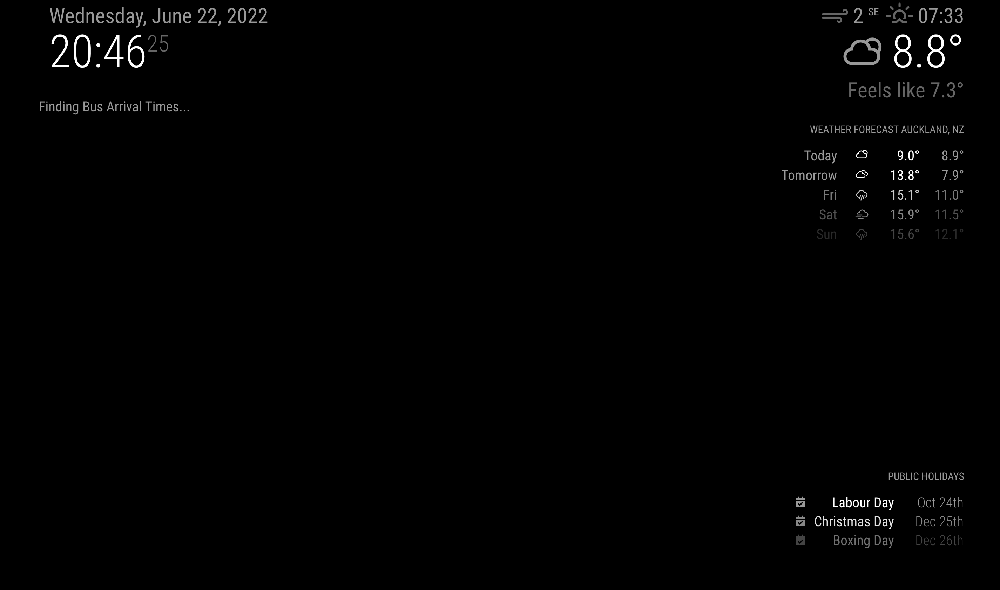
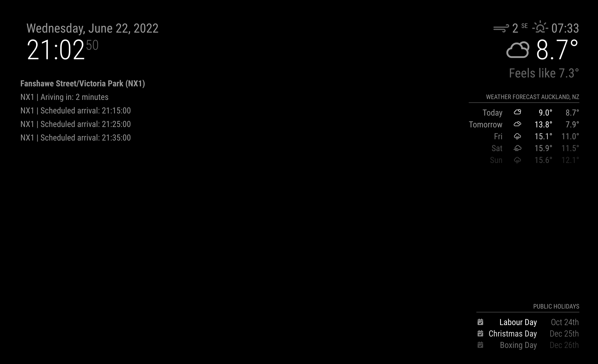
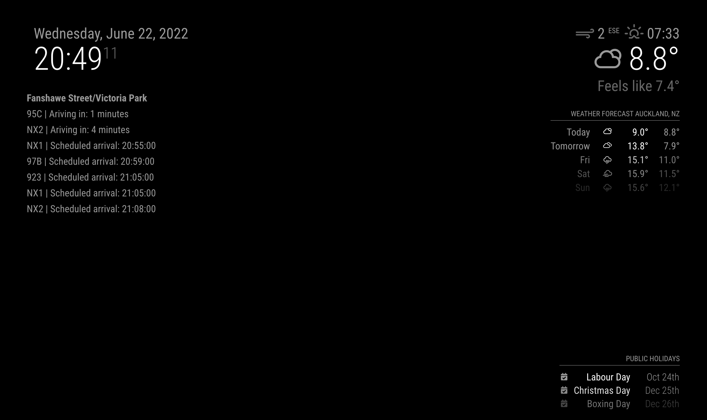

# MMM-AT-Bus

This an extension for the [MagicMirror](https://github.com/MichMich/MagicMirror). It will display the minutes until arrival of a selected bus number to a selected stop. The bus number and stop code can be configured in the config file. To use this module you will need to create a free Auckland Transport Developer Portal account.

### Example shown top left:


## Installation

1. Navigate into your MagicMirror's `modules` folder
2. Execute `git clone https://github.com/Estanz0/MMM-AT-Bus.git`
3. Navigate to newly created folder `MMM-AT-Bus`

Using the module
Add the below to the modules array in the `config/config.js` file:

```javascript
modules: [
	{
		module: "MMM-AT-Bus",
		position: "top_left",
		config: {
			provider: "AT", // One of ['AT']
			routeShortNames: ["NX1", "82"], // The short name of the bus route
			stopCode: "7036", // The bus stop code (Displayed on Google maps)
			forwardLimitHours: 2, // Show trips which begin within the set number of hours
			refreshIntervalSeconds: 20, // Refresh frequency
			key: "api_key" // The API Key for the selected provider
		}
	}
];
```

## Configuration options

The following properties can be configured:

<table width="100%">
	<!-- why, markdown... -->
	<thead>
		<tr>
			<th>Option</th>
			<th width="100%">Description</th>
		</tr>
	<thead>
	<tbody>
		<tr>
			<td><code>provider</code></td>
            <td>API Provider
                </br>
                AT: Auckland Transport
			</td>
		</tr>
		<tr>
			<td><code>routeShortNames</code></td>
            <td>A list of bus routes
                </br>
                The route short name is generally 2 - 3 characters and numbers.
			</td>
		</tr>
		<tr>
			<td><code>stopCode</code></td>
			<td>The bus stop code. 
                </br>
                This can be found using the AT app, website or Google maps.
            </td>
		</tr>
		<tr>
			<td><code>forwardLimitHours</code></td>
			<td>Hours.
                		</br>
				Buses arriving further in the future than this limit will not be displayed.
            		</td>
		</tr>
		<tr>
			<td><code>refreshIntervalSeconds</code></td>
			<td>Seconds.
                		</br>
				How often the arrival times should be refreshed.
            		</td>
		</tr>
        <tr>
			<td><code>key</code></td>
			<td>A developer API key for the provider APIs. 
                </br>
                For AT this can be obtained by signing up for a developer account (subscription) through the <a href="https://dev-portal.at.govt.nz/products/">AT developer portal product subscription</a>.
                </br>
                Note: it can take a few days for your developer account to be activated after signing up.
            </td>
		</tr>
	</tbody>
</table>

### Finding bus route and stop

AT app:

-   Go to live departures and select a stop from the map.
-   Bus route can be seen on the left hand side.
-   Stop code can be found up the top.



### More Demo Images

#### Loading Screen



#### Bus and Stop Code configured



#### Only Stop Code configured



## Check out the other modules here

[3rd party Magic Mirror modules](https://github.com/MichMich/MagicMirror/wiki/3rd-Party-Modules)
